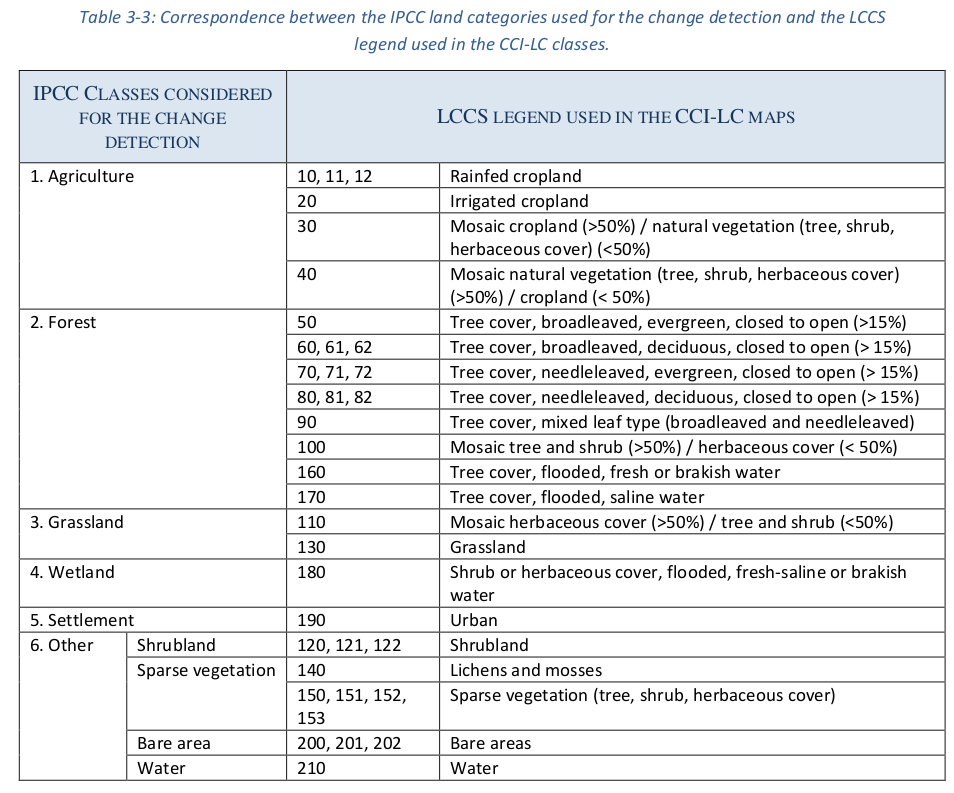

```{r param, include = F}
knitr::opts_chunk$set(message = FALSE)
# Output figure in HTML5
if (knitr::is_html_output()) {
    knitr::knit_hooks$set(
        plot = function(x, options) {
            cap <- options$fig.cap # figure caption
            tags <- htmltools::tags
            as.character(tags$figure(
                tags$img(src = x, alt = cap),
                tags$figcaption(cap)
            ))
        }
    )
}

# packages
library(dplyr)
library(stringr)
library(knitr)
library(plotly)
library(ggplot2)
library(terra)
library(gridExtra)
```

# Mise en contexte

**Définition**

Évolution dans le temps de la superficie des différents types d’utilisation du sol sur le territoire québécois.

**Lien avec le Nouveau cadre mondial de biodiversité de Kunming-Montréal**

**Cible 1** - Veiller à ce que toutes les zones fassent l'objet d'une planification spatiale participative, intégrée et respectueuse de la biodiversité et/ou soient gérées efficacement dans le cadre de processus de changement d'affectation des terres et des mers.

# Méthodologie

## Résumé méthodologique

- Reclassification des catégories d'utilisation du sol définies par ESA (tableau 1)
- Utilisation des données à partir de 2010 pour éviter la problématique de changement de méthodologie à partir de cette années
- Calcul de la proportion de pixels par type de catégories
- Calcul du taux de variation pour chaque catégorie en comparant avec l'année 1 (ici 2010)

## Traitement des catégories
```{r cat_treat, include = FALSE}
esa_cats <- read.csv("/home/local/USHERBROOKE/juhc3201/BdQc/ReseauSuivi/Indicators/G15_utilisation_terres/CCI-LC_Maps_Legend.csv")
names(esa_cats)[c(3, 4)] <- c("cat2", "desc2")
```
```{r MELCCFP_cat, echo = FALSE}
kable(esa_cats,
    caption = "Tab. 1. Différents niveaux de catégorisation des données ESA-LC",
    row.names = FALSE
)
```

# Visualisation classification niveau 2
## Échelle du Québec
```{r data_treat_qc_niv2, include = FALSE}
prop <- read.csv("/home/local/USHERBROOKE/juhc3201/BdQc/ReseauSuivi/Data/g15_indicators/results/ESA/2010-2020_frq_cat0_Qc.csv", h = T)

comp_2010 <- prop[order(prop$year), ]
comp_2010_ll <- split(comp_2010, comp_2010$cat0)
comp_2010_ll2 <- lapply(comp_2010_ll, function(x) {
    x$comp_2010 <- x$cat0_prop - x$cat0_prop[1]
    x
})

c2010 <- do.call("rbind", comp_2010_ll2)

df2 <- c2010 |>
    group_by(year, desc0)

df3 <- df2 %>%
    mutate(text = paste(
        "Catégorie: ", desc0,
        "\nAnnée: ", year,
        "\nVariation: ", comp_2010
    ))
```

```{r vis_qc_niv2, echo = FALSE}
p_qc <- ggplot(
    data = df3,
    aes(x = year, y = comp_2010, color = desc0)
) +
    geom_line(linewidth = 1) +
    scale_x_continuous(breaks = seq(2010, 2020, by = 1)) +
    labs(x = "Année", y = "Variation")

int_p <- ggplotly(p_qc, tooltip = "text")
int_p
```
# Visualisation par régions administratives couvertes par ISQ

Seules les régions administratives couvertes à 100% par l'ISQ sont utilisées (voir tableau 2.2.1 du [rapport méthodologique](https://statistique.quebec.ca/fr/fichier/comptes-des-terres-du-quebec-meridional-edition-revisee.pdf)) : **Bas-Saint-Laurent**, **Capitale-Nationale**, **Mauricie**, **Estrie**, **Montréal**, **Outaouais**, **Abitibi-Témiscamingue**, **Gaspésie–Îles-de-la-Madeleine**, **Chaudière-Appalaches**, **Laval**, **Lanaudière**, **Laurentides**, **Centre-du-Québec**.

Les catégories utilisées sont décrites dans le tableau suivant.



```{r data_IPCC_cat, echo=FALSE, include = FALSE}
comp <- readRDS("/home/local/USHERBROOKE/juhc3201/BdQc/ReseauSuivi/Data/g15_indicators/results/ESA/2010-2020_comp2010_ISQ_reg.rds")
comp_ls <- split(comp, comp$region)

IPCC_class <- c("agriculture", "forest", "grassland", "other", "settlement", "wetland")
pie <- comp[comp$year == 2010, c("region", "count_tot", "IPCC_class")]
pie_ls <- split(pie, pie$region)
pie_ls2 <- lapply(pie_ls, function(x) {
    missing_class <- IPCC_class[!IPCC_class %in% x$IPCC_class]
    if (length(missing_class) != 0) {
        missing_row <- data.frame(
            region = unique(x$region),
            count_tot = 0,
            IPCC_class = missing_class
        )
        x <- rbind(x, missing_row)
    }
    x[order(x$IPCC_class), ]
})
data_pie <- do.call("rbind", pie_ls2)


regions <- unique(comp$region)

colors <- c(
    "#993300", # agriculture
    "#006600", # forest
    "#CC9900", # grassland
    "#96ac9d", # other
    "#CC0000", # settlement
    "#019191" # wetland
)
# plot creation
plot_ls <- lapply(comp_ls, function(x) {
    ggplot(
        data = x,
        aes(x = year, y = comp_rate, group = IPCC_class, colour = IPCC_class)
    ) +
        geom_line(linewidth = 1) +
        labs(title = unique(x$region), color = "Catégories") +
        scale_color_manual(
            labels = c("agriculture", "forest", "grassland", "other", "settlement", "wetland"),
            values = colors
        ) +
        scale_y_continuous(name = "Variation (%)", limits = c(-35, 35))
})
```
```{r plot1, echo=FALSE, fig.show = "hold", out.width = "50%", warning = FALSE, message = FALSE}
# for (i in 1:length(plot_ls)) {
i <- 1
print(plot_ls[[i]])
# }
```
```{r pie1, echo=FALSE,warning = FALSE, message = FALSE}
# ```{r pie1, echo=FALSE, fig.show = "hold", out.width = "50%", warning = FALSE, message = FALSE}
data <- data_pie[data_pie$region == regions[i], ]
fig <- plot_ly(data,
    labels = ~IPCC_class, values = ~count_tot, type = "pie", textposition = "inside",
    textinfo = "label+percent",
    insidetextfont = list(color = "#FFFFFF"),
    hoverinfo = "text",
    text = ~ paste("n = ", count_tot),
    marker = list(
        colors = colors,
        line = list(color = "#FFFFFF", width = 1)
    ),

    # The 'pull' attribute can also be used to create space between the sectors

    showlegend = FALSE
)

fig <- fig %>% layout(
    xaxis = list(showgrid = FALSE, zeroline = FALSE, showticklabels = FALSE),
    yaxis = list(showgrid = FALSE, zeroline = FALSE, showticklabels = FALSE)
)

plo <- plot_ly(y = data_pie$count_tot[data_pie$region == "Abitibi-Témiscamingue"], name = data_pie$IPCC_class[data_pie$region == "Abitibi-Témiscamingue"], type = "bar") %>% layout(showlegend = FALSE)


subplo <- subplot(plot_ls[[i]], plo) %>%
    layout(title = "Side By Side Subplots")

subplo
# }


p <- plot_ly()

p <- p %>% add_pie(data = data_pie[data_pie$region == "Abitibi-Témiscamingue",],
                   labels = ~IPCC_class,
                   values = ~count_tot,
                   name = "Abitibi-Témiscamingue",
                   domain = list(x = c(0, 0.4), y = c(0.4, 1)))
p <- p %>% add_pie(data = data_pie[data_pie$region == "Bas-Saint-Laurent",],
                   labels = ~IPCC_class,
                   values = ~count_tot,
                   name = "Bas-Saint-Laurent",
                   domain = list(x = c(0.6, 1), y = c(0.4, 1)))
p
```

```{r plot2, echo=FALSE, fig.show = "hold", out.width = "50%", warning = FALSE, message = FALSE}
# for (i in 1:length(plot_ls)) {
i <- 2
print(plot_ls[[i]])
# }
```
```{r pie2, echo=FALSE, fig.show = "hold", out.width = "50%", warning = FALSE, message = FALSE}
data <- data_pie[data_pie$region == regions[i], ]
fig <- plot_ly(data,
    labels = ~IPCC_class, values = ~count_tot, type = "pie", textposition = "inside",
    textinfo = "label+percent",
    insidetextfont = list(color = "#FFFFFF"),
    hoverinfo = "text",
    text = ~ paste("n = ", count_tot),
    marker = list(
        colors = colors,
        line = list(color = "#FFFFFF", width = 1)
    ),

    # The 'pull' attribute can also be used to create space between the sectors

    showlegend = FALSE
)

fig <- fig %>% layout(
    xaxis = list(showgrid = FALSE, zeroline = FALSE, showticklabels = FALSE),
    yaxis = list(showgrid = FALSE, zeroline = FALSE, showticklabels = FALSE)
)


fig
# }
```


```{r plot3, echo=FALSE, fig.show = "hold", out.width = "50%", warning = FALSE, message = FALSE}
# for (i in 1:length(plot_ls)) {
i <- 3
print(plot_ls[[i]])
# }
```
```{r pie3, echo=FALSE, fig.show = "hold", out.width = "50%", warning = FALSE, message = FALSE}
data <- data_pie[data_pie$region == regions[i], ]
fig <- plot_ly(data,
    labels = ~IPCC_class, values = ~count_tot, type = "pie", textposition = "inside",
    textinfo = "label+percent",
    insidetextfont = list(color = "#FFFFFF"),
    hoverinfo = "text",
    text = ~ paste("n = ", count_tot),
    marker = list(
        colors = colors,
        line = list(color = "#FFFFFF", width = 1)
    ),

    # The 'pull' attribute can also be used to create space between the sectors

    showlegend = FALSE
)

fig <- fig %>% layout(
    xaxis = list(showgrid = FALSE, zeroline = FALSE, showticklabels = FALSE),
    yaxis = list(showgrid = FALSE, zeroline = FALSE, showticklabels = FALSE)
)


fig
# }
```

```{r plot4, echo=FALSE, fig.show = "hold", out.width = "50%", warning = FALSE, message = FALSE}
# for (i in 1:length(plot_ls)) {
i <- 4
print(plot_ls[[i]])
# }
```
```{r pie4, echo=FALSE, fig.show = "hold", out.width = "50%", warning = FALSE, message = FALSE}
data <- data_pie[data_pie$region == regions[i], ]
fig <- plot_ly(data,
    labels = ~IPCC_class, values = ~count_tot, type = "pie", textposition = "inside",
    textinfo = "label+percent",
    insidetextfont = list(color = "#FFFFFF"),
    hoverinfo = "text",
    text = ~ paste("n = ", count_tot),
    marker = list(
        colors = colors,
        line = list(color = "#FFFFFF", width = 1)
    ),

    # The 'pull' attribute can also be used to create space between the sectors

    showlegend = FALSE
)

fig <- fig %>% layout(
    xaxis = list(showgrid = FALSE, zeroline = FALSE, showticklabels = FALSE),
    yaxis = list(showgrid = FALSE, zeroline = FALSE, showticklabels = FALSE)
)


fig
# }
```


```{r plot5, echo=FALSE, fig.show = "hold", out.width = "50%", warning = FALSE, message = FALSE}
# for (i in 1:length(plot_ls)) {
i <- 5
print(plot_ls[[i]])
# }
```
```{r pie5, echo=FALSE, fig.show = "hold", out.width = "50%", warning = FALSE, message = FALSE}
data <- data_pie[data_pie$region == regions[i], ]
fig <- plot_ly(data,
    labels = ~IPCC_class, values = ~count_tot, type = "pie", textposition = "inside",
    textinfo = "label+percent",
    insidetextfont = list(color = "#FFFFFF"),
    hoverinfo = "text",
    text = ~ paste("n = ", count_tot),
    marker = list(
        colors = colors,
        line = list(color = "#FFFFFF", width = 1)
    ),

    # The 'pull' attribute can also be used to create space between the sectors

    showlegend = FALSE
)

fig <- fig %>% layout(
    xaxis = list(showgrid = FALSE, zeroline = FALSE, showticklabels = FALSE),
    yaxis = list(showgrid = FALSE, zeroline = FALSE, showticklabels = FALSE)
)


fig
# }
```

```{r plot6, echo=FALSE, fig.show = "hold", out.width = "50%", warning = FALSE, message = FALSE}
# for (i in 1:length(plot_ls)) {
i <- 6
print(plot_ls[[i]])
# }
```
```{r pie6, echo=FALSE, fig.show = "hold", out.width = "50%", warning = FALSE, message = FALSE}
data <- data_pie[data_pie$region == regions[i], ]
fig <- plot_ly(data,
    labels = ~IPCC_class, values = ~count_tot, type = "pie", textposition = "inside",
    textinfo = "label+percent",
    insidetextfont = list(color = "#FFFFFF"),
    hoverinfo = "text",
    text = ~ paste("n = ", count_tot),
    marker = list(
        colors = colors,
        line = list(color = "#FFFFFF", width = 1)
    ),

    # The 'pull' attribute can also be used to create space between the sectors

    showlegend = FALSE
)

fig <- fig %>% layout(
    xaxis = list(showgrid = FALSE, zeroline = FALSE, showticklabels = FALSE),
    yaxis = list(showgrid = FALSE, zeroline = FALSE, showticklabels = FALSE)
)


fig
# }
```

```{r plot7, echo=FALSE, fig.show = "hold", out.width = "50%", warning = FALSE, message = FALSE}
# for (i in 1:length(plot_ls)) {
i <- 7
print(plot_ls[[i]])
# }
```
```{r pie7, echo=FALSE, fig.show = "hold", out.width = "50%", warning = FALSE, message = FALSE}
data <- data_pie[data_pie$region == regions[i], ]
fig <- plot_ly(data,
    labels = ~IPCC_class, values = ~count_tot, type = "pie", textposition = "inside",
    textinfo = "label+percent",
    insidetextfont = list(color = "#FFFFFF"),
    hoverinfo = "text",
    text = ~ paste("n = ", count_tot),
    marker = list(
        colors = colors,
        line = list(color = "#FFFFFF", width = 1)
    ),

    # The 'pull' attribute can also be used to create space between the sectors

    showlegend = FALSE
)

fig <- fig %>% layout(
    xaxis = list(showgrid = FALSE, zeroline = FALSE, showticklabels = FALSE),
    yaxis = list(showgrid = FALSE, zeroline = FALSE, showticklabels = FALSE)
)


fig
# }
```

```{r plot8, echo=FALSE, fig.show = "hold", out.width = "50%", warning = FALSE, message = FALSE}
# for (i in 1:length(plot_ls)) {
i <- 8
print(plot_ls[[i]])
# }
```
```{r pie8, echo=FALSE, fig.show = "hold", out.width = "50%", warning = FALSE, message = FALSE}
data <- data_pie[data_pie$region == regions[i], ]
fig <- plot_ly(data,
    labels = ~IPCC_class, values = ~count_tot, type = "pie", textposition = "inside",
    textinfo = "label+percent",
    insidetextfont = list(color = "#FFFFFF"),
    hoverinfo = "text",
    text = ~ paste("n = ", count_tot),
    marker = list(
        colors = colors,
        line = list(color = "#FFFFFF", width = 1)
    ),

    # The 'pull' attribute can also be used to create space between the sectors

    showlegend = FALSE
)

fig <- fig %>% layout(
    xaxis = list(showgrid = FALSE, zeroline = FALSE, showticklabels = FALSE),
    yaxis = list(showgrid = FALSE, zeroline = FALSE, showticklabels = FALSE)
)


fig
# }
```

```{r plot9, echo=FALSE, fig.show = "hold", out.width = "50%", warning = FALSE, message = FALSE}
# for (i in 1:length(plot_ls)) {
i <- 9
print(plot_ls[[i]])
# }
```
```{r pie9, echo=FALSE, fig.show = "hold", out.width = "50%", warning = FALSE, message = FALSE}
data <- data_pie[data_pie$region == regions[i], ]
fig <- plot_ly(data,
    labels = ~IPCC_class, values = ~count_tot, type = "pie", textposition = "inside",
    textinfo = "label+percent",
    insidetextfont = list(color = "#FFFFFF"),
    hoverinfo = "text",
    text = ~ paste("n = ", count_tot),
    marker = list(
        colors = colors,
        line = list(color = "#FFFFFF", width = 1)
    ),

    # The 'pull' attribute can also be used to create space between the sectors

    showlegend = FALSE
)

fig <- fig %>% layout(
    xaxis = list(showgrid = FALSE, zeroline = FALSE, showticklabels = FALSE),
    yaxis = list(showgrid = FALSE, zeroline = FALSE, showticklabels = FALSE)
)


fig
# }
```

```{r plot10, echo=FALSE, fig.show = "hold", out.width = "50%", warning = FALSE, message = FALSE}
# for (i in 1:length(plot_ls)) {
i <- 10
print(plot_ls[[i]])
# }
```
```{r pie10, echo=FALSE, fig.show = "hold", out.width = "50%", warning = FALSE, message = FALSE}
data <- data_pie[data_pie$region == regions[i], ]
fig <- plot_ly(data,
    labels = ~IPCC_class, values = ~count_tot, type = "pie", textposition = "inside",
    textinfo = "label+percent",
    insidetextfont = list(color = "#FFFFFF"),
    hoverinfo = "text",
    text = ~ paste("n = ", count_tot),
    marker = list(
        colors = colors,
        line = list(color = "#FFFFFF", width = 1)
    ),

    # The 'pull' attribute can also be used to create space between the sectors

    showlegend = FALSE
)

fig <- fig %>% layout(
    xaxis = list(showgrid = FALSE, zeroline = FALSE, showticklabels = FALSE),
    yaxis = list(showgrid = FALSE, zeroline = FALSE, showticklabels = FALSE)
)


fig
# }
```

```{r plot11, echo=FALSE, fig.show = "hold", out.width = "50%", warning = FALSE, message = FALSE}
# for (i in 1:length(plot_ls)) {
i <- 11
print(plot_ls[[i]])
# }
```
```{r pie11, echo=FALSE, fig.show = "hold", out.width = "50%", warning = FALSE, message = FALSE}
data <- data_pie[data_pie$region == regions[i], ]
fig <- plot_ly(data,
    labels = ~IPCC_class, values = ~count_tot, type = "pie", textposition = "inside",
    textinfo = "label+percent",
    insidetextfont = list(color = "#FFFFFF"),
    hoverinfo = "text",
    text = ~ paste("n = ", count_tot),
    marker = list(
        colors = colors,
        line = list(color = "#FFFFFF", width = 1)
    ),

    # The 'pull' attribute can also be used to create space between the sectors

    showlegend = FALSE
)

fig <- fig %>% layout(
    xaxis = list(showgrid = FALSE, zeroline = FALSE, showticklabels = FALSE),
    yaxis = list(showgrid = FALSE, zeroline = FALSE, showticklabels = FALSE)
)


fig
# }
```

```{r plot12, echo=FALSE, fig.show = "hold", out.width = "50%", warning = FALSE, message = FALSE}
# for (i in 1:length(plot_ls)) {
i <- 12
print(plot_ls[[i]])
# }
```
```{r pie12, echo=FALSE, fig.show = "hold", out.width = "50%", warning = FALSE, message = FALSE}
data <- data_pie[data_pie$region == regions[i], ]
fig <- plot_ly(data,
    labels = ~IPCC_class, values = ~count_tot, type = "pie", textposition = "inside",
    textinfo = "label+percent",
    insidetextfont = list(color = "#FFFFFF"),
    hoverinfo = "text",
    text = ~ paste("n = ", count_tot),
    marker = list(
        colors = colors,
        line = list(color = "#FFFFFF", width = 1)
    ),

    # The 'pull' attribute can also be used to create space between the sectors

    showlegend = FALSE
)

fig <- fig %>% layout(
    xaxis = list(showgrid = FALSE, zeroline = FALSE, showticklabels = FALSE),
    yaxis = list(showgrid = FALSE, zeroline = FALSE, showticklabels = FALSE)
)


fig
# }
```


```{r plot13, echo=FALSE, fig.show = "hold", out.width = "50%", warning = FALSE, message = FALSE}
# for (i in 1:length(plot_ls)) {
i <- 13
print(plot_ls[[i]])
# }
```
```{r pie13, echo=FALSE, fig.show = "hold", out.width = "50%", warning = FALSE, message = FALSE}
data <- data_pie[data_pie$region == regions[i], ]
fig <- plot_ly(data,
    labels = ~IPCC_class, values = ~count_tot, type = "pie", textposition = "inside",
    textinfo = "label+percent",
    insidetextfont = list(color = "#FFFFFF"),
    hoverinfo = "text",
    text = ~ paste("n = ", count_tot),
    marker = list(
        colors = colors,
        line = list(color = "#FFFFFF", width = 1)
    ),

    # The 'pull' attribute can also be used to create space between the sectors

    showlegend = FALSE
)

fig <- fig %>% layout(
    xaxis = list(showgrid = FALSE, zeroline = FALSE, showticklabels = FALSE),
    yaxis = list(showgrid = FALSE, zeroline = FALSE, showticklabels = FALSE)
)


fig
# }
```